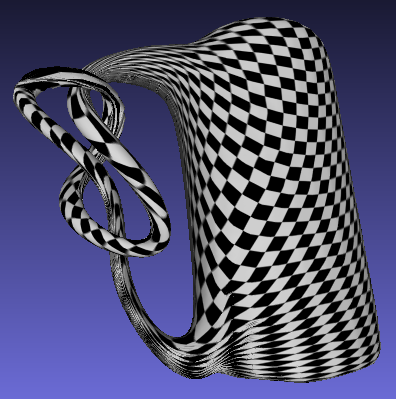
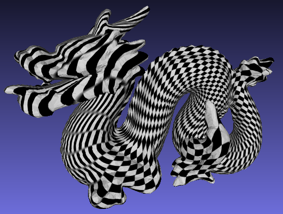
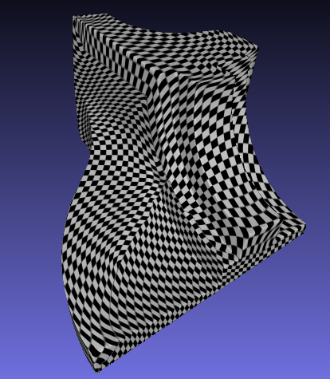
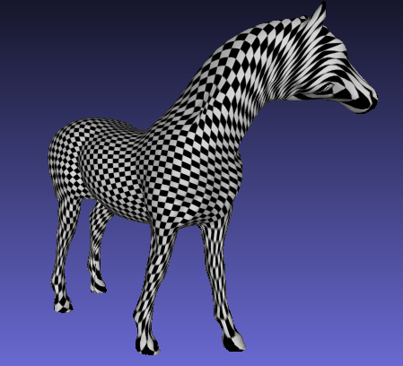

# Mesh Parameterizatin

## Requirements
[QuadDouble](https://github.com/Sanaxen/QuadDouble)  
[OpenGI](https://sourceforge.net/projects/opengi/)   [download](http://opengi.sourceforge.net/downloads.html)  
GNU Library or Lesser General Public License version 3.0 (LGPLv3)  
Visual Studio 2017 C++  

##Parameterizatin  
UV mapping the mesh of the correct topology   (**Parameterizatin**).Therefore, high Genus meshes are cut automatically.

 
 

This program has been modified to handle a single batch by omitting the OpenGI (**LGPL**) visualization.
In addition, since it is necessary to perform high-precision numerical calculation to eliminate the instability of numerical calculation, it has been changed to double double precision calculation.
We are also parallelizing with OpenMP.
The cut boundaries are also output simultaneously.
The original is available from the following site, but a copy is included in the org directory.

**examples**
 
 
 
